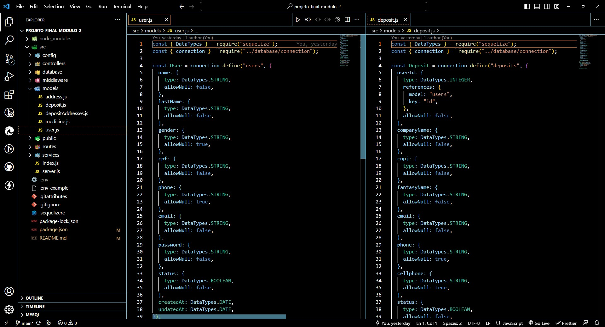
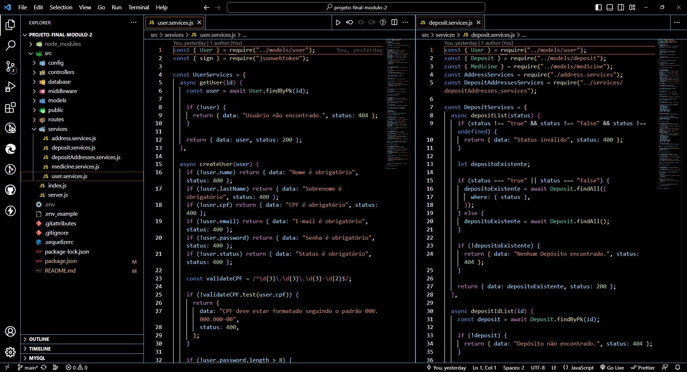
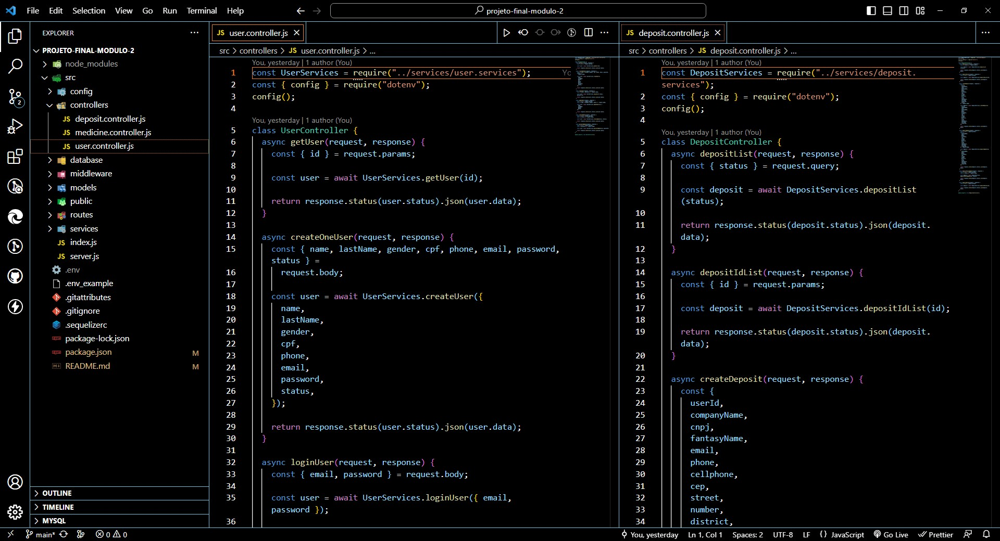
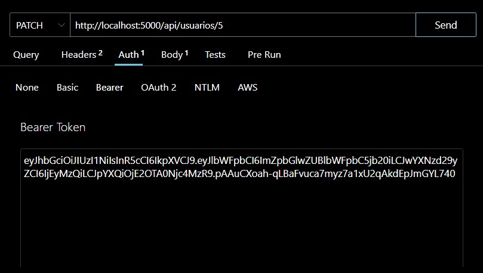

# Lages Pharmacy System 
# Sobre o projeto

Lages Pharmacy System é uma aplicação Back-end construída durante o segundo módulo do **Curso Full Stack**, organizado pelo [SESI/SENAI](https://cursos.sesisenai.org.br/ "Site do SESI/SENAI"), [LAB365](https://lab365.tech/ "Site do LAB365") e [floripamaistec](https://floripamaistec.pmf.sc.gov.br/ "Site do floripamaistec").

A aplicação consiste em um sistema Back-end para gerenciar cadastros de usuários, depósitos e medicamentos de uma Indústria Tecnológica da área Farmacêutica. Nele é possível realizar o CRUD (Create, Read, Update e Delete), em cada tabela inserida no Banco de Dados.

## Camada Models 
Responsável pela estruturação das tabelas e suas relações no Banco de Dados:
 
## Camada Services
Responsável por todas as regras de negócios da aplicação, validações e integração com serviços externos:

## Camada Controllers
Responsável por receber as solicitações (requests) dos clientes, processá-las e coordenar a interação entre as camadas: 


# Tecnologias utilizadas
- NodeJS
- Express
- Sequelize
- JWT (Jason Web Token)
# Como executar o projeto
```bash
# clonar repositório
git clone https://github.com/filipebratti/projeto-final-modulo-2

# entrar na pasta do projeto
cd projeto-final-modulo-2

# instalar dependências
npm install / npm i

# configurar variáveis de ambiente através do arquivo .env tendo como base o arquivo .env_example:
DIALECT = 
HOST = 
USERNAMEDB = 
PASSWORDDB = 
DATABASE = 
PORT = 
SECRET_JWT = 

# executar o projeto
npm run start:dev

# criar migrations:
npx sequelize-cli db:migrate
```
# Como utilizar o sistema

Depois dos passos realizados anteriormente, utilize uma ferramenta para realizar as requisições necessárias da aplicação. As mais utilizadas atualmente são Thunder Cliente, Postman e Insomnia.

https://www.thunderclient.com/

https://www.postman.com/

https://insomnia.rest/download

Utilize os arquivos dentro da pasta **routes** como guia para especificar as rotas na ferramenta escolhida, sempre lembrando de escolher o método correto para cada rota (GET, POST, PATCH, DELETE).

Para rotas que necessitam de autenticação é necessário copiar o código criptografado recebido na resposta da requisição de loginUser e inserir na Bearer da aba Auth da requisição.


# Autor

Filipe Bratti Schmidt

https://www.linkedin.com/in/filipe-bratti-schmidt-408a925b/

# Agradecimentos

Gostaria de agradecer aos professores <a href="https://www.linkedin.com/in/bruno-costa-b9b3141a2/">Bruno Costa</a>, <a href="https://www.linkedin.com/in/pedro-h-b-da-silva/">Pedro Henrique Barroso da Silva</a> e <a href="https://www.linkedin.com/in/rawan-hawangledt/">Rawan Campos</a> por todos ensinamentos passados e por toda paciência nas aulas.

